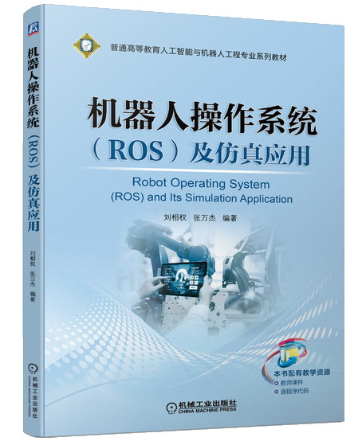
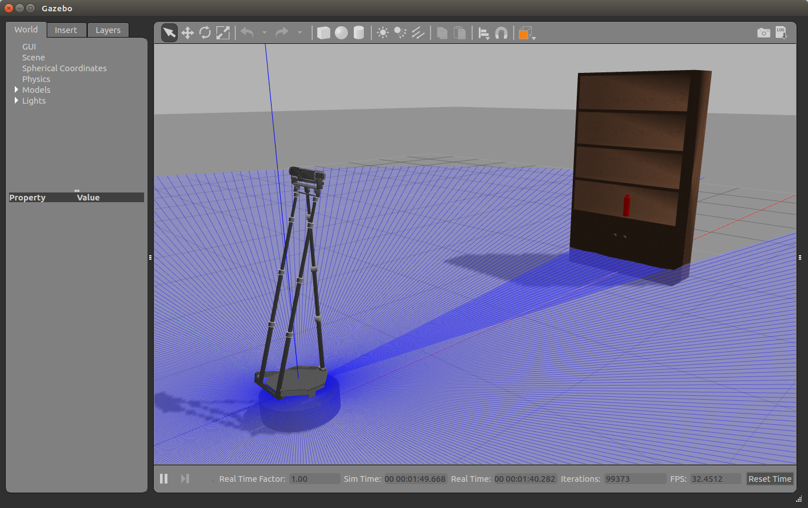
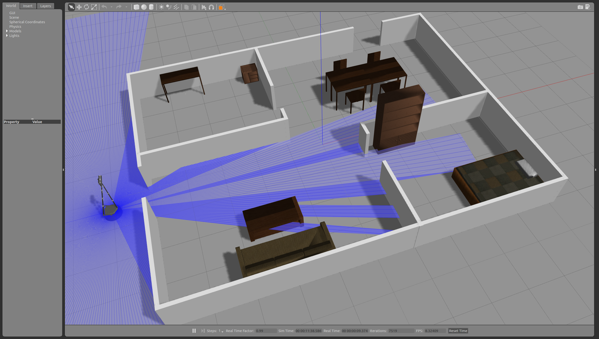
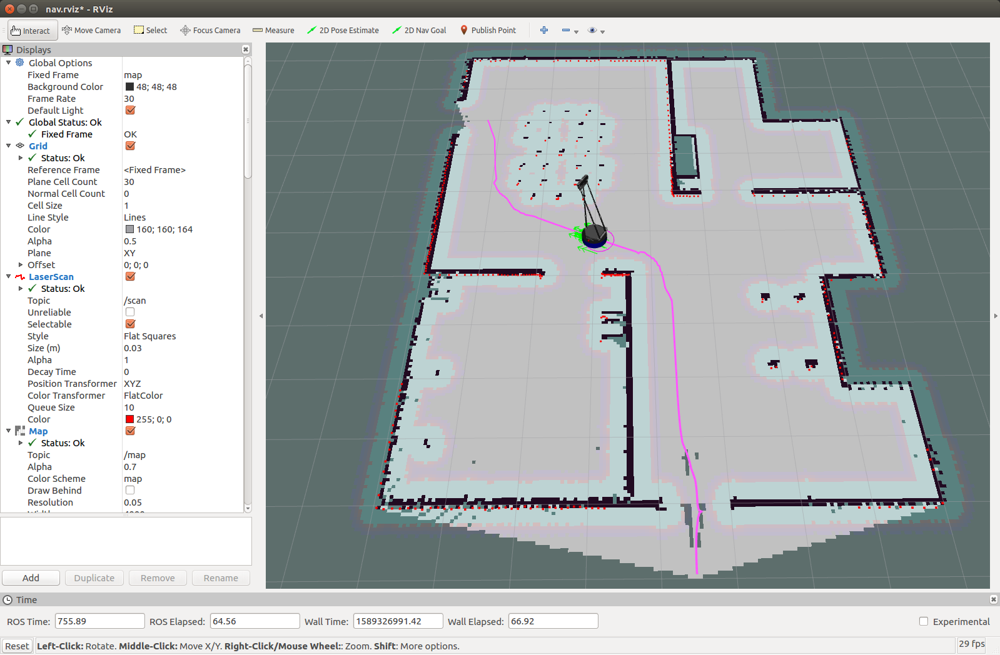
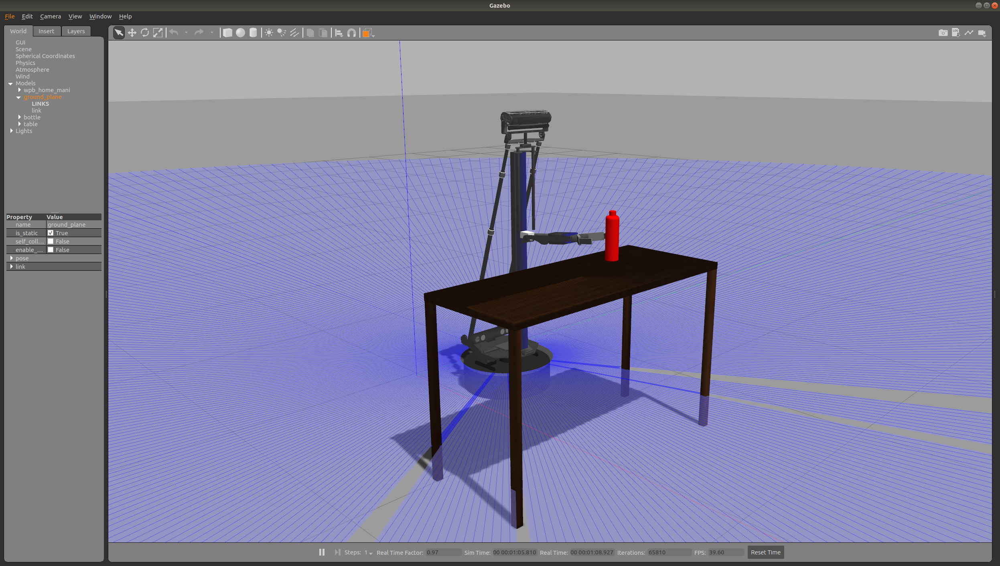
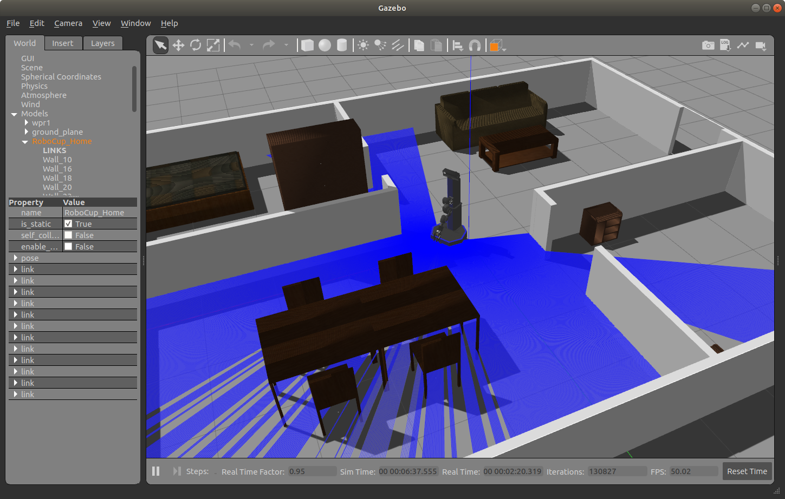
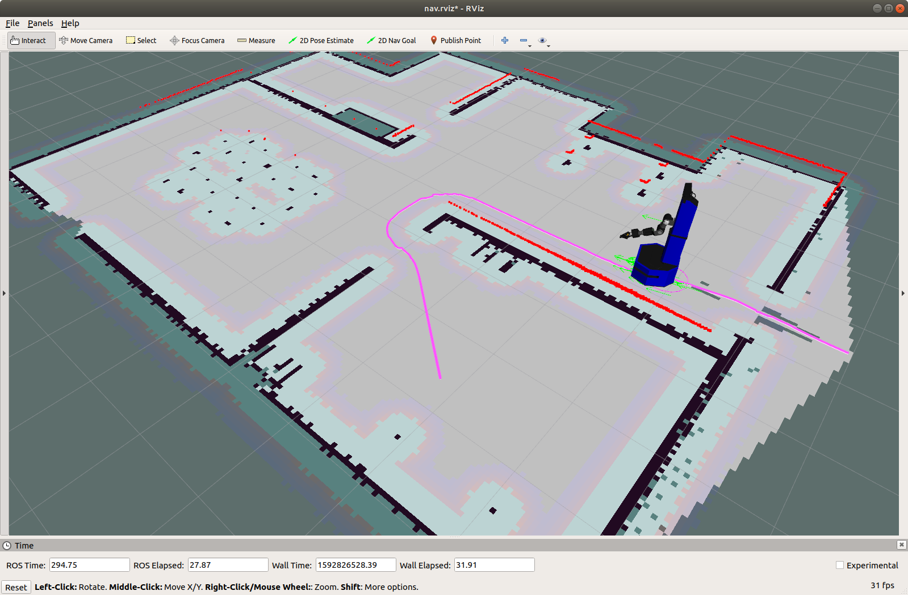

# WPR系列机器人仿真工具

## 配套视频课程

Bilibili: [机器人操作系统ROS 快速入门教程](https://www.bilibili.com/video/BV1BP4y1o7pw/)  
Youtube: [机器人操作系统ROS 快速入门教程](https://www.youtube.com/watch?v=Zs3ic0Im4D8&list=PLu0hA5NOMC0lZDGBkXwTb5NGUapAeUPPp)

## 配套教材书籍
1、机器人操作系统(ROS)及仿真应用（C++）  


2、轮式智能移动操作机器人技术与应用（Python）  


## 系统版本

- ROS Noetic (Ubuntu 20.04)

## 使用说明

### 一、 启智ROS机器人
1. 获取源码:
```
cd ~/catkin_ws/src/
git clone https://github.com/6-robot/wpr_simulation.git
git clone https://github.com/6-robot/wpb_home.git
git clone https://github.com/6-robot/waterplus_map_tools.git
```
2. 安装依赖项:  
ROS Noetic (Ubuntu 20.04)
```
cd ~/catkin_ws/src/wpr_simulation/scripts
./install_for_noetic.sh
cd ~/catkin_ws/src/wpb_home/wpb_home_bringup/scripts
./install_for_noetic.sh
cd ~/catkin_ws/src/waterplus_map_tools/scripts
./install_for_noetic.sh
```
3. 编译
```
cd ~/catkin_ws
catkin_make
```

简单场景:
```
roslaunch wpr_simulation wpb_simple.launch
```


SLAM环境地图创建:
```
roslaunch wpr_simulation wpb_gmapping.launch
```


Navigation导航:
```
roslaunch wpr_simulation wpb_navigation.launch
```


物品抓取:
```
roslaunch wpr_simulation wpb_table.launch
rosrun wpb_home_tutorials wpb_home_grab_client
```


### 二、 启明1服务机器人
1. 获取源码:
```
cd ~/catkin_ws/src/
git clone https://github.com/6-robot/wpr_simulation.git
git clone https://github.com/6-robot/wpr1.git
git clone https://github.com/6-robot/waterplus_map_tools.git
git clone https://github.com/6-robot/xfyun_waterplus.git
```
2. 安装依赖项:  
ROS Noetic (Ubuntu 20.04)
```
cd ~/catkin_ws/src/wpr_simulation/scripts
./install_for_noetic.sh
cd ~/catkin_ws/src/wpr1/wpr1_bringup/scripts
./install_for_noetic.sh
cd ~/catkin_ws/src/waterplus_map_tools/scripts
./install_for_noetic.sh
```
3. 编译
```
cd ~/catkin_ws
catkin_make
```

简单场景:
```
roslaunch wpr_simulation wpr1_simple.launch
```


SLAM环境地图创建:
```
roslaunch wpr_simulation wpr1_gmapping.launch
```


Navigation导航:
```
roslaunch wpr_simulation wpr1_navigation.launch
```
